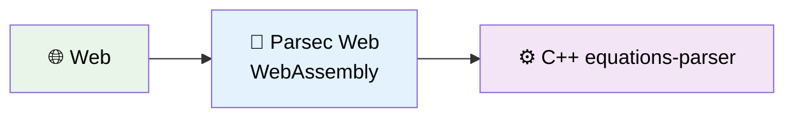

<p align="center">
  
</p>

<p align="center">
  Parsec Web: A generalized JavaScript library that connects to equations-parser WebAssembly for cross-platform equation evaluation
</p>

## 🎯 Project Overview

**Parsec Web** is a generalized JavaScript library that connects to the equations-parser WebAssembly module (C++ code) for high-performance equation evaluation. This library is designed to be reusable across multiple platforms including:

- **Frontend Projects**: React, Vue, Angular, vanilla JavaScript
- **Flutter Web Projects**: Via dart:js_interop integration
- **Node.js Applications**: As an importable library
- **Cross-Platform Solutions**: General enough to work across different JavaScript environments

The library transforms equation processing from server-dependent operations to lightning-fast client-side computations using WebAssembly, making it completely offline-capable and infinitely scalable.

### 🔄 Architecture Transformation

**Before (Traditional Backend):**


❌ Problems: Network latency, server costs, scaling issues, offline limitations

**After (Parsec Web):**



✅ Benefits: Zero latency, no server costs, infinite scalability, offline capable

### 📋 Key Features

- **100x Faster**: ~1ms vs ~110ms equation processing
- **Zero Infrastructure**: No backend servers needed
- **Full Offline Support**: Works without internet
- **Complete Feature Parity**: All equations-parser functions available
- **Cross-Platform**: Web, Mobile, Desktop support

## 🚀 Quick Start

### Prerequisites

- Emscripten SDK installed and configured
- Modern web browser with ES6 module support
- Local web server (Python, Node.js, or similar)

#### Prerequisites for Building

1. **Modern web browser with ES6 module support.**
2. **Local web server.** (Python, Node.js, or similar)
3. **The project requires Emscripten to compile C++ to WebAssembly.** You can install it via:
  3.1 **System package manager**:  `apt-get install emscripten` (Linux)
  3.2 **Official download**: https://emscripten.org/docs/getting_started/downloads.html
  3.3 **emsdk**: Manual setup with the Emscripten SDK

The build script will automatically detect your Emscripten installation and compile the equations-parser C++ library to WebAssembly.

### Expected Results
- ✅ "WebAssembly module ready!" status message
- ✅ Interactive math function testing
- ✅ Automated test suite passes
- ✅ C++ debug output in console

### Build and Test

```bash
# 1. Build the WebAssembly module
chmod +x build.sh
./build.sh

# 2. Start local server
python3 -m http.server 8000

# 3. Open test page
# Navigate to: http://localhost:8000/html/equations-parser-test.html
```

### Installation

```bash
# Install the library (when published to npm)
npm install parsec-web

# Or clone and install for development
git clone <repository-url>
cd parsec-web
npm install

# Build WebAssembly module (requires emsdk)
# Uses system Emscripten installation or emsdk
./build.sh
```

## 🎯 Core Features

**Parsec Web** integrates the equations-parser C++ library via WebAssembly, delivering:

- **Native Type Conversion**: Automatic conversion from C++ to JavaScript types (number, string, boolean)
- **Complete Function Support**: All equations-parser features available
  - **Math functions**: sin, cos, tan, ln, log, abs, sqrt, pow, exp, etc.
  - **String functions**: concat, length, toupper, tolower, left, right
  - **Complex functions**: real, imag, conj, arg, norm
  - **Array functions**: sizeof, eye, ones, zeros
  - **Date functions**: current_date, daysdiff, hoursdiff
  - **Advanced operators**: ternary operators, comparison operators

**Direct Value Returns:**

```javascript
// JavaScript-native values (recommended)
parsec.eval('2 + 3') // → 5 (number)
parsec.eval('sin(pi/2)') // → 1.0 (number)
parsec.eval('5 > 3') // → true (boolean)
parsec.eval('concat("a","b")') // → "ab" (string)

// Raw C++ JSON strings (for platform consistency)
parsec.evalRaw('2 + 3') // → '{"val": "5", "type": "i"}'
parsec.evalRaw('sin(pi/2)') // → '{"val": "1", "type": "f"}'
parsec.evalRaw('5 > 3') // → '{"val": "true", "type": "b"}'
parsec.evalRaw('concat("a","b")') // → '{"val": "ab", "type": "s"}'
```

## 🧪 Comprehensive Testing

**Professional Testing Framework**: Vitest-based testing with complete coverage

### Test Coverage
- **Unit Tests**: Arithmetic, Trigonometry, Logarithms, String Functions, Date Functions, Complex Numbers, Array Operations
- **Integration Tests**: Complex expressions, Mixed data types, Function combinations
- **Error Handling**: Syntax errors, Runtime errors, Type errors, Edge cases
- **Performance Benchmarks**: Speed tracking with regression detection
- **Cross-Browser Compatibility**: ES6 modules with WebAssembly support

### Example Test Cases

#### Mathematical Operations
```javascript
"2 + 3 * 4" → 14
"sin(pi/2)" → 1
"sqrt(pow(3,2) + pow(4,2))" → 5
"log(exp(2))" → 2
```

#### String Operations
```javascript
"concat('Hello', ' World')" → "Hello World"
"toupper('hello')" → "HELLO"
"length('test')" → 4
```

#### Conditional Logic
```javascript
"true ? 5 : 3" → 5
"5 > 3" → true
"!false" → true
```

#### Error Handling
```javascript
"5 / 0" → Error: "Division by zero"
"invalidfunc(5)" → Error: "Unknown function: invalidfunc"
"2 + " → Error: "Unexpected end of expression"
```

### Running Tests

```bash
npm test                      # Run complete test suite
npm run test:watch            # Development mode with auto-rerun
npm run test:coverage         # Generate coverage report
npm run test:unit             # Unit tests only
npm run test:integration      # Integration tests only
npm run test:performance      # Performance benchmarks
```

## 💼 Professional Code Quality

**Enterprise-Grade Development Environment**:

- **Multi-Format Package**: CommonJS, ES6 modules, TypeScript definitions
- **Cross-Platform Exports**: Works in Node.js, browsers, and bundlers
- **ESLint + Prettier**: Automated code formatting and quality checking
- **Git Strategy**: Proper `.gitignore` with submodule exclusion

**Code Quality Commands:**

```bash
npm run lint          # Check code quality
npm run lint:fix      # Auto-fix linting issues
npm run format        # Format code with Prettier
npm run style:fix     # Fix both linting and formatting
```

### Basic Usage

#### **ES6 Modules (Recommended)**

```javascript
import { Parsec } from 'parsec-web'

const parsec = new Parsec()
await parsec.initialize()

// Basic evaluation
const result = parsec.eval('2 + 3 * sin(pi/2)')
console.log(result.value) // 5
console.log(result.type) // 'f' (float)

// Batch evaluation
const results = parsec.evaluateBatch(['2 + 2', 'sqrt(16)', 'concat("Hello", " World")'])

// Get library info
console.log(parsec.getInfo())
```

#### **CommonJS (Node.js)**

```javascript
const { Parsec } = require('parsec-web')

const parsec = new Parsec()
await parsec.initialize()

const result = parsec.eval('sin(pi/2) + cos(0)')
console.log(result.value) // 2
```

#### **TypeScript**

```typescript
import { Parsec, EquationResult } from 'parsec-web'

const parsec = new Parsec()
await parsec.initialize()

const result: EquationResult = parsec.eval('abs(-42)')
if (result.success) {
  console.log(`Result: ${result.value}`) // Result: 42
}
```

### Development Setup

```bash
# 1. Clone and install dependencies
git clone <repository-url>
cd parsec-web
npm install

# 2. Build the WebAssembly module (auto-installs emsdk on first run)
chmod +x build.sh
./build.sh

# 3. Run tests
npm test

# 4. Start development server
npm run dev
# Navigate to: http://localhost:8000

# 5. Code formatting and linting
npm run style:fix
```

#### Building WebAssembly Module

The build process compiles the equations-parser C++ library to WebAssembly:

- **Clean builds**: Re-run `./build.sh` anytime to rebuild the WASM module
- **Automatic detection**: Finds all required C++ source files automatically
- **Optimized output**: Produces a compact WebAssembly module (~636KB)

If you encounter build issues, ensure Emscripten is properly installed and available in your PATH.

## 📦 Publishing to npm

The repository is fully configured as a production-ready npm package. Here's how to publish it:

### Package Structure

The package provides multiple entry points for maximum compatibility:

- **CommonJS entry**: `index.cjs` for Node.js `require()`
- **ES Module entry**: `index.mjs` for modern `import`
- **TypeScript definitions**: `types.d.ts` with complete type safety
- **Dual module support**: Works with both CommonJS and ES modules

### Publishing Steps

```bash
# 1. Ensure everything is built and tested
npm run build          # Builds WebAssembly module
npm test              # Runs comprehensive test suite
npm run lint          # Checks code quality

# 2. Test the package locally
npm pack --dry-run    # Preview what will be published

# 3. Login to npm (if not already logged in)
npm login

# 4. Publish to npm registry
npm publish

# 5. Or publish as scoped package with public access
npm publish --access public
```

### Package Scripts

The package includes automated quality checks:

- **`prepublishOnly`**: Runs build, tests, and linting before publish
- **`prepack`**: Ensures fresh WebAssembly build before packaging

### Installation for End Users

Once published, users can install the package:

```bash
npm install parsec-web
```

### Usage Examples for End Users

```javascript
// CommonJS (Node.js)
const { Parsec } = require('parsec-web')

// ES Modules (modern JavaScript)
import { Parsec } from 'parsec-web'

// TypeScript
import { Parsec, EquationResult } from 'parsec-web'

// Usage
const parsec = new Parsec()
await parsec.initialize()
const result = parsec.eval('2 + 3 * 4') // Returns: 14

// Batch evaluation
const results = parsec.evaluateBatch(['2+2', 'sqrt(16)', 'sin(pi/2)'])

// With timeout protection
const result = await parsec.evaluateWithTimeout('complex_expression', 5000)
```

### Cross-Platform Compatibility

The published package works across:

- **Frontend Projects**: React, Vue, Angular, vanilla JavaScript
- **Node.js Applications**: Both CommonJS and ES modules
- **TypeScript Projects**: Full type definitions included
- **Bundlers**: Webpack, Rollup, Vite, Parcel
- **Flutter Web**: Via dart:js_interop integration

## ✨ Library Implementation

**Parsec Web** is a complete, production-ready library that includes:

**Core Implementation:**
- Equations-parser C++ library integrated via WebAssembly
- Native type conversion system with automatic C++ to JavaScript type mapping
- Comprehensive equation evaluation with full feature parity
- Professional testing framework with Vitest for complete coverage

**Key Components:**
- **WebAssembly Module**: Compiled equations-parser C++ library
- **JavaScript Wrapper**: Clean API with error handling and type conversion
- **Testing Suite**: Unit tests, integration tests, error handling, and performance benchmarks
- **Multi-format Package**: CommonJS, ES6 modules, and TypeScript definitions

**Supported Features:**
- Mathematical functions (trigonometry, logarithms, arithmetic)
- String manipulation functions
- Complex number operations
- Array/matrix functions
- Date/time calculations
- Conditional logic and comparison operators

## 📁 Project Structure

```
parsec-web/
├── cpp/                    # C++ source files
│   └── equations-parser/   # Git submodule with C++ library
├── js/                     # JavaScript wrapper libraries
│   └── equations_parser_wrapper.js  # Clean API for WASM functions
├── tests/                  # Vitest test suites
│   ├── unit/              # Unit tests by function category
│   └── integration/       # Integration tests
├── wasm/                   # Generated WASM files (build output)
├── docs/                   # Documentation (if any)
│   └── (documentation files)
├── build.sh                # WebAssembly build script
└── README.md               # This file
```

## 🧪 Testing Strategy

The project uses **Vitest** as the primary testing framework for comprehensive equation evaluation testing:

### **Test Categories**

1. **Unit Tests**: Individual function categories (arithmetic, trigonometry, logarithms, strings, dates, complex, arrays)
2. **Integration Tests**: Complex expressions with mixed types and function combinations
3. **Error Handling**: Comprehensive validation of syntax errors, runtime errors, type errors
4. **Performance Benchmarks**: Execution time tracking with regression detection
5. **Cross-Browser Compatibility**: ES6 modules with WebAssembly support validation

### **Running Tests**

```bash
# Install dependencies
npm install

# Run all tests
npm test

# Run tests in watch mode
npm run test:watch

# Generate coverage report
npm run test:coverage

# Run specific test suites
npm run test:unit          # Unit tests only
npm run test:integration   # Integration tests only
npm run test:performance   # Performance benchmarks only
```

### **Code Quality & Formatting**

The project uses **Prettier** + **ESLint** for consistent code formatting and quality:

```bash
# Check code formatting
npm run format:check

# Auto-fix formatting
npm run format

# Run linting
npm run lint

# Auto-fix linting issues
npm run lint:fix

# Fix both linting and formatting
npm run style:fix
```

**Prettier Configuration:**

- Single quotes, no semicolons
- 2-space indentation, 100 character line width
- ES5 trailing commas, avoid arrow parentheses

## 📖 API Reference

### **Core Methods**

#### `parsec.eval(equation)`

Evaluate a single mathematical expression and return JavaScript-native values.

```javascript
const result = parsec.eval('2 + 3 * 4')
// Returns: 14

const text = parsec.eval('concat("Hello", " World")')
// Returns: "Hello World"

const boolean = parsec.eval('5 > 3')
// Returns: true
```

#### `parsec.evalRaw(equation)`

Evaluate a single mathematical expression and return raw C++ JSON strings for platform consistency.

```javascript
const result = parsec.evalRaw('2 + 3 * 4')
// Returns: '{"val": "14", "type": "i"}'

const text = parsec.evalRaw('concat("Hello", " World")')
// Returns: '{"val": "Hello World", "type": "s"}'

const boolean = parsec.evalRaw('5 > 3')
// Returns: '{"val": "true", "type": "b"}'

// Parse the JSON to access individual components
const parsed = JSON.parse(result)
console.log(parsed.val)  // "14"
console.log(parsed.type) // "i" (integer)
```

#### `parsec.evaluateBatch(equations)`

Evaluate multiple expressions in one call.

```javascript
const results = parsec.evaluateBatch(['2+2', 'sqrt(16)', 'sin(pi/2)'])
// Returns array of results with index information
```

#### `parsec.evaluateWithTimeout(equation, timeoutMs)`

Evaluate with timeout protection.

```javascript
const result = await parsec.evaluateWithTimeout('complex_expression', 5000)
// Returns: the evaluated result (number, string, or boolean)
```

### **Library Information**

#### `parsec.getInfo()`

Get comprehensive library metadata.

```javascript
const info = parsec.getInfo()
console.log(info.supportedPlatforms) // ['Browser (ES6)', 'Node.js', ...]
console.log(info.features) // ['WebAssembly performance', 'Offline capability', ...]
```

#### `parsec.getSupportedFunctions()`

Get detailed information about all available mathematical functions, organized by category.

### **Import Methods**

#### **ES6 Modules**

```javascript
import { Parsec } from 'parsec-web'
import Parsec from 'parsec-web' // Default import
```

#### **CommonJS**

```javascript
const { Parsec } = require('parsec-web')
```

#### **TypeScript**

```typescript
import { Parsec, EquationResult, BatchEvaluationResult } from 'parsec-web'
```

## 📚 Documentation

- **Code Comments**: Detailed explanations in all source files
- **Build Scripts**: Self-documenting with extensive comments
- **Development Guide**: See CLAUDE.md for detailed development instructions

## 🔧 Technical Stack

- **C++17+**: Modern C++ with Emscripten bindings
- **Emscripten**: Latest version with optimized flags
- **JavaScript ES6+**: Modules, async/await, classes
- **TypeScript**: Full type definitions included
- **WebAssembly**: Binary format with JavaScript integration
- **Equations-Parser Library**: Advanced mathematical expression evaluator
- **Vitest**: Modern testing framework for comprehensive test coverage
- **Prettier + ESLint**: Code formatting and quality assurance
- **Multi-format exports**: ES6, CommonJS, UMD compatibility
- **Flutter 3.x**: `dart:js_interop` for web integration (future enhancement)

## 🔮 Future Development

### Flutter Web Integration

**Goal**: Create Flutter Web bindings using `dart:js_interop`

**Planned Features**:
- Dart type-safe API wrapper
- Asset bundling for Flutter projects
- Future-based async/await patterns
- Cross-platform compatibility

**Usage Preview**:

```dart
import 'package:parsec_equations_lib/parsec_equations_lib.dart';

final parsec = Parsec();
await parsec.initialize();

final result = await parsec.evaluate('2 + 3 * sin(pi/2)');
print(result.value); // 5
```

### Cross-Platform Mobile Integration

**Optional Extension**: Mobile/desktop platform support through Flutter

**Planned Features**:
- Platform detection (web vs mobile/desktop)
- Platform Channel integration for mobile/desktop
- Unified Flutter interface across all platforms
- Factory pattern for service creation
