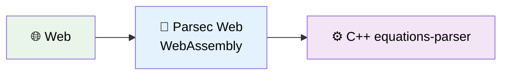

<p align="center">
  
</p>

<p align="center">
  Parsec Web: A very light parser for equations using WebAssembly in equations-parser
</p>

## 🎯 Project Overview

Parsec Web transforms equation processing from server-dependent operations to lightning-fast client-side computations using WebAssembly.

### 🔄 Architecture Transformation

**Before (Traditional Backend):**


❌ Problems: Network latency, server costs, scaling issues, offline limitations

**After (Parsec Web):**


✅ Benefits: Zero latency, no server costs, infinite scalability, offline capable

### 📋 Key Features
- **100x Faster**: ~1ms vs ~110ms equation processing
- **Zero Infrastructure**: No backend servers needed
- **Full Offline Support**: Works without internet
- **Complete Feature Parity**: All equations-parser functions available
- **Cross-Platform**: Web, Mobile, Desktop support

## 🏗️ Implementation Phases

### ✅ Phase 1: Basic WebAssembly + JavaScript Integration
**Status**: Ready for testing  
**Goal**: Create and test C++ → WASM → JavaScript integration

**What's included:**
- C++ math functions (`sum`, `multiply`)
- Emscripten compilation setup
- JavaScript wrapper library
- Interactive HTML test page
- Comprehensive documentation

**Files:**
- `cpp/math_functions.cpp` - C++ source with Emscripten bindings
- `build.sh` - Compilation script with detailed flags
- `js/math_wrapper.js` - JavaScript wrapper with error handling
- `html/test.html` - Interactive test interface
- `docs/phase1-guide.md` - Complete setup and testing guide

### 🔄 Phase 2: Equations-Parser WebAssembly Integration *(Coming Next)*
**Goal**: Compile the real equations-parser C++ library to WebAssembly and create comprehensive web testing interface

**What's planned:**
- Replace toy math functions with actual equations-parser library
- Set up equations-parser as git submodule from `https://github.com/oxeanbits/equations-parser`
- Compile the comprehensive equation evaluation from `equations-parser` lib to WASM. Also setup a main function called `eval_equation(equation)`, where the `equation` is a string. This `equation` is the string that is the main input sent to the `equations-parser` library for evaluation
- The output type of this `eval_equation(equation)` can have different types actually: string, float, decimal, integer, boolean. It depends entirety on the result of the equation evaluation
- Create enhanced HTML + JavaScript testing interface
- Support for all equations-parser features:
  - **Math functions**: sin, cos, tan, ln, log, abs, sqrt, pow, exp, etc.
  - **String functions**: concat, length, toupper, tolower, left, right
  - **Complex functions**: real, imag, conj, arg, norm  
  - **Array functions**: sizeof, eye, ones, zeros
  - **Date functions**: current_date, daysdiff, hoursdiff
  - **Advanced operators**: ternary operators, comparison operators
  - **Multiple return types**: integer/float, string, boolean values

### 🔄 Phase 3: Automated tests for the Equations-Parser WebAssembly library
**Goal**: Comprehensive test suite ensuring equations-parser WASM reliability and correctness

**What's planned:**
- **Unit Tests**: Individual function testing for all equation types
- **Performance Tests**: Execution time benchmarks vs native implementations
- **Edge Case Tests**: Boundary conditions and error handling validation
- **Cross-Browser Tests**: Compatibility across major browsers

#### 📋 Test Categories

##### 🧮 **Basic Arithmetic Tests**
```javascript
// Simple operations
"2 + 3" → 5
"10 - 4" → 6  
"7 * 8" → 56
"15 / 3" → 5
"2 ^ 3" → 8
"10 % 3" → 1

// Order of operations
"2 + 3 * 4" → 14
"(2 + 3) * 4" → 20
"2 + 3 * 4 - 1" → 13
"2 ^ 3 ^ 2" → 512
```

##### 📐 **Mathematical Functions Tests**
```javascript
// Trigonometric functions
"sin(0)" → 0
"cos(0)" → 1
"tan(pi/4)" → 1
"asin(1)" → π/2
"acos(0)" → π/2
"atan(1)" → π/4

// Logarithmic functions  
"ln(e)" → 1
"log(100)" → 2
"log(1000, 10)" → 3
"exp(1)" → e

// Power and root functions
"sqrt(16)" → 4
"pow(2, 3)" → 8
"abs(-5)" → 5
"round(3.6)" → 4
```

##### 🔤 **String Functions Tests**
```javascript
// String operations
"concat('Hello', ' ', 'World')" → "Hello World"
"length('test')" → 4
"toupper('hello')" → "HELLO"  
"tolower('WORLD')" → "world"
"left('testing', 4)" → "test"
"right('testing', 3)" → "ing"
```

##### 📅 **Date/Time Functions Tests**
```javascript
// Date operations
"current_date()" → "2024-MM-DD"
"daysdiff('2024-01-01', '2024-01-10')" → 9
"hoursdiff('2024-01-01 12:00', '2024-01-01 15:30')" → 3.5
"weekday('2024-01-01')" → 1 // Monday
```

##### ❓ **Conditional/Logical Tests**
```javascript
// Ternary operators
"true ? 5 : 3" → 5
"false ? 5 : 3" → 3
"(2 > 1) ? 'yes' : 'no'" → "yes"

// Comparison operators
"5 > 3" → true
"2 < 1" → false
"4 >= 4" → true
"3 <= 2" → false
"5 == 5" → true
"5 != 3" → true

// Logical operators
"true && true" → true
"true || false" → true
"!false" → true
```

##### 🔀 **Complex Expression Tests**
```javascript
// Nested functions
"sin(cos(pi/3))" → sin(0.5) → ~0.479
"sqrt(pow(3,2) + pow(4,2))" → 5
"log(exp(2))" → 2

// String and math combinations
"length(concat('test', '123')) + 5" → 12
"toupper('hello') == 'HELLO'" → true
```

##### ⚠️ **Error Handling Tests**
```javascript
// Division by zero
"5 / 0" → Error: "Division by zero"
"1 / (2 - 2)" → Error: "Division by zero"

// Invalid functions
"invalidfunc(5)" → Error: "Unknown function: invalidfunc"
"sin()" → Error: "Invalid number of arguments for sin"

// Type mismatches  
"'hello' + 5" → Error: "Type mismatch in addition"
"sin('not_a_number')" → Error: "Invalid argument type"

// Syntax errors
"2 + " → Error: "Unexpected end of expression"
"((2 + 3)" → Error: "Mismatched parentheses"
```

##### ⚡ **Performance Benchmark Tests**
```javascript
// Speed comparisons (WASM vs JavaScript)
Simple: "2 + 3" → Target: < 1ms
Medium: "sin(cos(tan(0.5)))" → Target: < 2ms  
Complex: "sqrt(pow(sin(0.5), 2) + pow(cos(0.5), 2)) * log(exp(2.718))" → Target: < 5ms
Heavy: "sum(sin(1), cos(2), tan(3), ln(4), sqrt(5), abs(-6), pow(7,2), exp(0.5))" → Target: < 20ms
```

#### 🛠️ **Test Infrastructure**
- **Test Runner**: Custom JavaScript test framework with WebAssembly integration
- **Assertion Library**: Comprehensive floating-point equality with epsilon tolerance
- **Browser Testing**: Automated testing across Chrome, Firefox, Safari, Edge
- **CI Integration**: GitHub Actions pipeline with test result reporting
- **Coverage Reports**: Function coverage analysis for equations-parser features
- **Performance Monitoring**: Execution time tracking and regression detection

#### 📁 **Test Files Structure**
```
tests/
├── unit/                           # Individual function tests
│   ├── arithmetic.test.js         # Basic math operations
│   ├── trigonometry.test.js       # Sin, cos, tan, etc.
│   ├── logarithms.test.js         # Log, ln, exp functions
│   ├── strings.test.js            # String manipulation
│   ├── complex.test.js            # Complex number operations
│   ├── arrays.test.js             # Array/matrix functions
│   └── dates.test.js              # Date/time functions
├── integration/                    # End-to-end workflows
│   ├── complex-expressions.test.js # Nested function calls
│   ├── multi-variable.test.js     # Variable assignments
│   └── mixed-types.test.js        # String/number combinations
├── performance/                    # Speed benchmarks
│   ├── simple-ops.bench.js        # Basic arithmetic timing
│   ├── function-calls.bench.js    # Mathematical function timing
│   └── complex-expr.bench.js      # Complex expression timing
├── errors/                         # Error handling validation
│   ├── syntax-errors.test.js      # Invalid syntax cases
│   ├── runtime-errors.test.js     # Division by zero, etc.
│   └── type-errors.test.js        # Type mismatch scenarios
├── browser/                        # Cross-browser compatibility
│   └── compatibility.test.js      # Browser-specific tests
└── test-runner.js                  # Main test orchestration
```

#### 🎯 **Success Criteria**
- ✅ **100% Function Coverage**: All equations-parser features tested
- ✅ **Cross-Browser Compatible**: Works in Chrome, Firefox, Safari, Edge  
- ✅ **Performance Targets Met**: < 5ms for complex expressions
- ✅ **Error Handling Robust**: Graceful failure for all edge cases
- ✅ **Regression Prevention**: Automated CI prevents functionality breaks
- ✅ **Documentation Complete**: Every test case clearly documented


### 🔄 Phase 4: Flutter Web Integration *(Planned)*
**Goal**: Integrate equations-parser WASM with a small Flutter Web using `dart:js_interop`

**What's planned:**
- Clean Flutter project structure
- `dart:js_interop` bindings for equations-parser functions
- Abstract service interface for cross-platform compatibility
- Web-specific service implementation
- Flutter UI for equation input and result display

### 🔄 Phase 5: Cross-Platform Mobile Integration *(Optional)*
**Goal**: Extend Flutter integration to mobile/desktop platforms

**What's planned:**
- Factory pattern for service creation
- Platform detection (web vs mobile/desktop)
- Platform Channel integration for mobile/desktop
- Unified Flutter interface across all platforms

## 🚀 Quick Start (Phase 1)

### Prerequisites
- Emscripten SDK installed and configured
- Modern web browser with ES6 module support
- Local web server (Python, Node.js, or similar)

### Build and Test
```bash
# 1. Build the WebAssembly module
chmod +x build.sh
./build.sh

# 2. Start local server
python3 -m http.server 8000

# 3. Open test page
# Navigate to: http://localhost:8000/html/test.html
```

### Expected Results
- ✅ "WebAssembly module ready!" status message
- ✅ Interactive math function testing
- ✅ Automated test suite passes
- ✅ C++ debug output in console

## 📁 Project Structure

```
parsec-web/
├── cpp/                    # C++ source files
│   └── math_functions.cpp  # Math functions with WASM bindings
├── js/                     # JavaScript wrapper libraries  
│   └── math_wrapper.js     # Clean API for WASM functions
├── html/                   # Test HTML files
│   └── test.html           # Interactive test interface
├── wasm/                   # Generated WASM files (build output)
├── docs/                   # Documentation
│   └── phase1-guide.md     # Detailed Phase 1 instructions
├── build.sh                # Emscripten compilation script
└── README.md               # This file
```

## 🧪 Testing Strategy

Each phase includes comprehensive testing:

1. **Build Verification**: Compilation succeeds without errors
2. **Module Loading**: WASM loads correctly in browser
3. **Function Testing**: All exposed functions work as expected
4. **Error Handling**: Proper error messages and recovery
5. **Performance**: Acceptable execution times
6. **Cross-Browser**: Works in major browsers

## 📚 Documentation

- **[Phase 1 Guide](docs/phase1-guide.md)**: Complete setup and testing instructions
- **Code Comments**: Detailed explanations in all source files
- **Build Scripts**: Self-documenting with extensive comments

## 🔧 Technical Stack

- **C++17+**: Modern C++ with Emscripten bindings
- **Emscripten**: Latest version with optimized flags
- **JavaScript ES6**: Modules, async/await, classes
- **WebAssembly**: Binary format with JavaScript integration
- **Equations-Parser Library**: Advanced mathematical expression evaluator
- **Flutter 3.x**: `dart:js_interop` for web integration (Phase 3+)

## 📈 Progress Overview

1. ✅ **Phase 1 Complete**: Toy WebAssembly integration working
2. **Phase 2 Ready**: Integrate real equations-parser C++ library
   - Set up equations-parser as git submodule
   - Replace toy functions with comprehensive equation evaluation
   - Create advanced testing interface for all equation types
3. **Phase 3**: Automated tests for the WebAssembly library compiled from equations-parser
4. **Phase 4**: Flutter Web integration with equations-parser WASM
5. **Phase 5**: Cross-platform mobile/desktop integration (optional)
